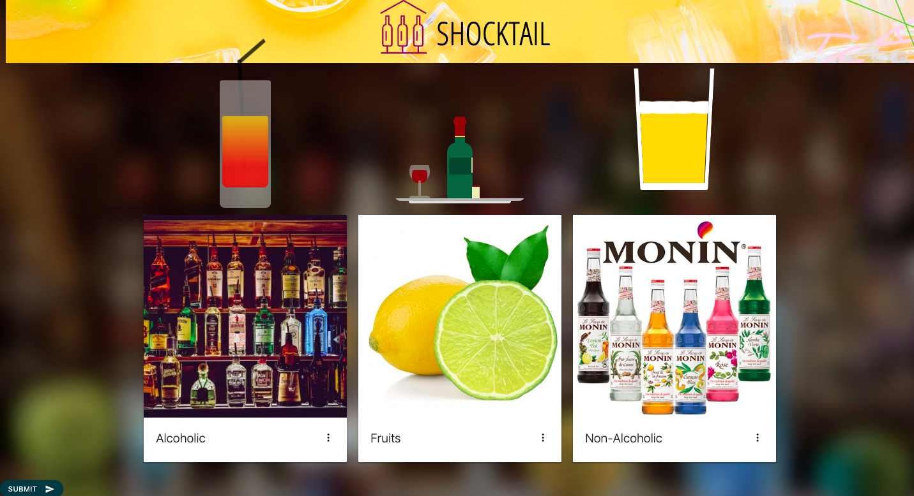
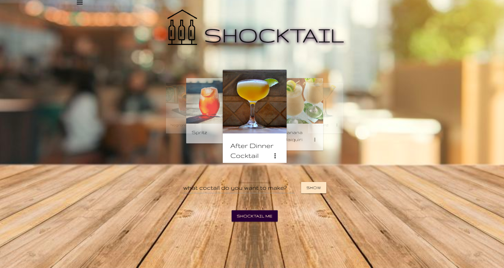

## Shocktail

## Screenshots of the Website

### User Signed-In


### Preference Page

​
### Main Page


## Description

This is a web application that features Shocktail. Shocktail is a web application that can be used to find recipes for cocktails from TheCocktailDB from the comforts of home using names of alcoholic beverages, non-alcoholic beverages, and fruits. It features a sign-up and sign-in page as the beginning of the website. After signing into the website, the user finds an age verification popup. If the user clicks "Disagree", then the there will be an alert saying, "You must be 21 to enter" and then the popup reloads. Clicking "Agree" will close the popup and will lead to the preference page. The user can now click on the cards and choose whichever ingredients they want for the search. Then after clicking the submit button, it will lead to the main page of Shocktail. On the main page, there is a carousel containing dynamically generated cards based on the search from the preferences. Each card has a description and recipe after clicking on them. From here, the user can choose to search via sidenav, search bar, or click the shocktailme button for a random drink dynamically generated on a card that also contains a description and recipe for the drink.

### Login Page


Shocktail features a sign-up and sign-in page as the beginning of the website. After signing into the website, the user finds an age verification popup.
The login page sign-up and sign-in are authenticated via Firebase. The username and password are stored in the Firebase realtime database as well as MySQL via a user model seen here: 

```js
module.exports = function (sequelize, DataTypes) {
    var User = sequelize.define("User", {
        username: {
            type: DataTypes.STRING,
            validate: {
                // allowNull: false,
                // notEmpty: true,
                len: [1, 30]
            }
        },
        password: {
            type: DataTypes.STRING,
            validate: {
                // allowNull: false
            }
        },
        id: {
            type: DataTypes.INTEGER,
            autoIncrement: true,
            primaryKey: true
        }
    });
    return User;
}
```

The user model contains keys for username, password, and an autoincrementing id. There used to be an age key, but my group and I agreed to remove it in order to streamline the project due to time constraints. The call to the database is seen here: 
```js
    $.post("/api/users",
        {
            username: username,
            password: password
        }).then(function (data, status) {
            alert("Data: " + data + "\nStatus: " + status);
        });

```
Our route that sends our call to the database is found here: 
```js
app.post("/api/users", function(req, res){
        var username = req.body.username;
        var password = req.body.password;
        console.log(username, password);
        db.User.create({
            username: username, 
            password: password
        }).then(function(dbUser){
            res.json(dbUser);
        });
    });
```
This is now found in our MySQL seen here: 


After, we can use the same username and password and log into the website. The age verification then pops up via a Materialize modal.

### Preference Page


 If the user clicks "Disagree", then the there will be an alert saying, "You must be 21 to enter" and then the popup reloads. Clicking "Agree" will close the popup and will lead to the preference page. The user can now click on the cards and choose whichever ingredients they want for the search. 

The submit button needs to get the latest id from the user table and then take the preferences and id and push them into the pref table via the pref model seen here: 

```js
module.exports = function (sequelize, DataTypes) {
    var Pref = sequelize.define("Pref", {
        id: {
            type: DataTypes.INTEGER,
            autoIncrement: true,
            primaryKey: true,
            validate: {
                allownull: false
            }
        },
        vodka: {
            type: DataTypes.BOOLEAN,
        },
        rum: {
            type: DataTypes.BOOLEAN,
        },
        tequila: {
            type: DataTypes.BOOLEAN,
        },
        gin: {
            type: DataTypes.BOOLEAN,
        },
        triple_sec: {
            type: DataTypes.BOOLEAN,
        },
        whiskey: {
            type: DataTypes.BOOLEAN,
        },
        kahlua: {
            type: DataTypes.BOOLEAN,
        },
        champagne: {
            type: DataTypes.BOOLEAN,
        },
        jagermeister: {
            type: DataTypes.BOOLEAN,
        },
        //
        orange: {
            type: DataTypes.BOOLEAN,
        },
        banana: {
            type: DataTypes.BOOLEAN,
        },
        lemon: {
            type: DataTypes.BOOLEAN,
        },
        pineapple: {
            type: DataTypes.BOOLEAN,
        },
        lime: {
            type: DataTypes.BOOLEAN,
        },
        strawberries: {
            type: DataTypes.BOOLEAN,
        },
        //
        
        cream: {
            type: DataTypes.BOOLEAN,
        },
        orange_juice: {
            type: DataTypes.BOOLEAN,
        },
        milk: {
            type: DataTypes.BOOLEAN,
        },
        cranberry_juice: {
            type: DataTypes.BOOLEAN,
        },
        soda_water: {
            type: DataTypes.BOOLEAN,
        },
        coffee: {
            type: DataTypes.BOOLEAN,
        },
        coca_cola: {
            type: DataTypes.BOOLEAN,
        },
        sugar: {
            type: DataTypes.BOOLEAN,
        },
        grenadine: {
            type: DataTypes.BOOLEAN,
        }
    });

    Pref.associate = function (models) {
        Pref.belongsTo(models.User, {
            foreignKey: {
                allowNull: false,
                references: { model: "users", key: "userId" } 
            }
        });
    };

    return Pref;
}
```

There is a key for every single preference button as well as the id of the user through foreign key. Because preferences are unique to users, the association is that Pref.belongsTo(models.User). The submit button event listener is the following in order to get the user and post the user and preferences into MySQL:
```js
$(document).on("click", "#submit", function () {
        var username;

        $.get("/api/users/:id", {
            where: {
                id: req.params.id
            }
        }, function (data) {
            username = data.username;
        });

        $.post("/api/pref", {
            vodka: $("#vodka").attr("data-bool"),
            rum: $("#rum").attr("data-bool"),
            tequila: $("#tequila").attr("data-bool"),
            gin: $("#gin").attr("data-bool"),
            triple_sec: $("#triple_sec").attr("data-bool"),
            whiskey: $("#whiskey").attr("data-bool"),
            kahlua: $("#kahlua").attr("data-bool"),
            champagne: $("#champagne").attr("data-bool"),
            jagermeister: $("#jagermeister").attr("data-bool"),
            orange: $("#orange").attr("data-bool"),
            banana: $("#banana").attr("data-bool"),
            lemon: $("#lemon").attr("data-bool"),
            pineapple: $("#pineapple").attr("data-bool"),
            lime: $("#lime").attr("data-bool"),
            strawberries: $("#strawberries").attr("data-bool"),
            cream: $("#cream").attr("data-bool"),
            orange_juice: $("#orange_juice").attr("data-bool"),
            milk: $("#milk").attr("data-bool"),
            cranberry_juice: $("#cranberry_juice").attr("data-bool"),
            soda_water: $("#soda_water").attr("data-bool"),
            coffee: $("#coffee").attr("data-bool"),
            coca_cola: $("#coca-cola").attr("data-bool"),
            sugar: $("#sugar").attr("data-bool"),
            grenadine: $("#grenadine").attr("data-bool")

        }).then(function (data, status) {
            alert("Data: " + data + "\nStatus: " + status);
        });

        window.location = "/main";
    })

    $(document).on("click", ".btn-small", function () {
        console.log("hello");
        var bool = $(this).attr("data-bool");
        if (bool === "false") {

            $(this).attr("data-bool", "true")
            $(this).addClass("red");
            bool = $(this).attr("data-bool");
            console.log(bool);
        }
        else {
            $(this).attr("data-bool", "false")
            $(this).removeClass("red");
            bool = $(this).attr("data-bool");
            console.log(bool);
        }
    })
```

Using the following route, the preferences and userid posts to MySQL:
```js
module.exports = function(app) {
    app.get("/api/pref", function(req, res) {
        var query = {};
        if (req.query.id) {
            query.id = req.query.id;
        }
        db.Pref.findAll({
            where: query,
            include: [db.User]
        }).then(function(dbPref) {
            res.json(dbPref);
        });
    });
};
```

Unfortunately, I was unable to get the post to the preferences table to work and is something that I want to work on in the future.

After clicking the submit button, it will lead to the main page of Shocktail.

 ### Main Page

 ##### Main page - Carousel Search and Search Bar


##### Main page - SideNav search


##### Main page - ShocktailMe button


##### Main page - SideNav search

 On the main page, there is a carousel containing dynamically generated cards based on the search from the preferences. Each card has a description and recipe after clicking on them. 
 
 From here, the user can choose to search via sidenav, search bar, or click the shocktailme button for a random drink dynamically generated on a card that also contains a description and recipe for the drink.

 The code for the sidenav is the following: 
 ```js
function dropDown() {
  debugger;
  var name = this.id;
  if ($("#" + name + "Div").css("display") == "none") {
    $("#" + name + "Div").show();
  } else {
    $("#" + name + "Div").css("display", "none");
  }
}
 ```
For the inputs within the sidenav, we have a createInput function: 
```js
function createInput(array, name) {
  // debugger;
  for (var i = 0; i < array.length; i++) {
    var newLabel = $("<label>");
    var newInput = $("<input>")
      .addClass("ing")
      .attr("type", "checkbox")
      .val(array[i]);
    var br = $("<br>");
    var newSpan = $("<span>").text(array[i].replace(/_/g, " "));
    newLabel.append(newInput, newSpan, br);
    $("#" + name).append(newLabel);
  }
}
```

In order to dynamically generate cards, we used the following code: 
```js
function createCard(drink) {
  // var drink = response.drinks[0];
  var drinkDiv = $("<div>").addClass("card");

  var cardImgDiv = $("<div>").addClass(
    "card-image waves-effect waves-block waves-light"
  );
  var drinkImg = $("").attr("src", drink.strDrinkThumb);
  cardImgDiv.append(drinkImg);

  var cardContentDiv = $("<div>").addClass("card-content");
  var icon = $("<i>")
    .addClass("material-icons right")
    .text("more_vert");

  var cardContentSpan = $("<span>")
    .addClass("card-title activator grey-text text-darken-4")
    .text(drink.strDrink)
    .append(icon);
  cardContentDiv.append(cardContentSpan);

  var cardRevealDiv = $("<div>").addClass("card-reveal");
  var iconClose = $("<i>")
    .addClass("material-icons right")
    .text("close");
  var cardRevealSpan = $("<span>")
    .addClass("card-title grey-text text-darken-4")
    .text(drink.strDrink)
    .append(iconClose);

  var drinkRecipe = $("<p>").text(drink.strInstructions);
  var drinkIngredients = $("<div>").html("<b> Ingregients </b>");
  getIngredients(drink, drinkIngredients);

  cardRevealDiv.append(cardRevealSpan, drinkRecipe, drinkIngredients);
  drinkDiv.append(cardImgDiv, cardContentDiv, cardRevealDiv);
  return drinkDiv;
}
```
This is the random button listener for the shocktailme button:
```js
function showRandom() {
  //debugger;
  var queryURL = "https://www.thecocktaildb.com/api/json/v2/8673533/random.php";

  $.ajax({
    url: queryURL,
    method: "GET"
  }).then(function(response) {
    $(".searchBar").hide();
    $(".carousel").hide();

    $(".coctailsList").empty();
    $(".popUp")
      .empty()
      .show()
      .css("zIndex", 11);
    var div = createCard(response.drinks[0]);
    var iconClosePop = $("<i>")
      .addClass("material-icons right ")
      .attr("id", "iconClosePop")
      .text("close")
      .on("click", function() {
        $(".searchBar").show();
        $(".carousel").show();
        $(".popUp").hide();
      });

    $(".popUp").append(div, iconClosePop);
  });
}
```

The following code for our search via alcohol name:
```js
function searchByName(event) {
  event.preventDefault();

  var usersInput = $("#usersInputName")
    .val()
    .trim()
    .replace(/ /g, "_");

  var queryURL =
    "https://www.thecocktaildb.com/api/json/v2/8673533/search.php?s=" +
    usersInput;
  console.log(queryURL);
  $.ajax({
    url: queryURL,
    method: "GET"
  }).then(function(response) {
    $(".column").empty();
    console.log(response);
    var drinks = response.drinks;
    debugger;
    if (drinks == null) {
      var img = $("")
        .attr("src", "../assets/images/sad-cartoon-margarita.png")
        .css({ width: "50%", clear: "both" });
      $("#col1")
        .empty()
        .html("<h4>None Found</h4>")
        .append(img);
    } else {
      for (var i = 0; i < drinks.length; i++) {
        var div = createCard(drinks[i]);

        $($(".column")[i % 2]).append(div);
      }
      var coctailsList = document.getElementById("coctailsList");

      coctailsList.scrollIntoView(true);
    }
  });
}
```

This is how we did our search by ingredients:
```js
function searchByIngredients(event) {
  event.preventDefault();
  var basicURL =
    "https://www.thecocktaildb.com/api/json/v2/8673533/filter.php?i=";

  var ingredients = [];
  $(".ing").each(function() {
    if ($(this).prop("checked")) {
      ingredients.push($(this).val());
    }
  });

  var queryURL = basicURL + ingredients.join(",");
  console.log(queryURL);

  $.ajax({
    url: queryURL,
    method: "GET"
  }).then(function(response) {
    debugger;
    var drinks = response.drinks;
    if (drinks == "None Found") {
      var img = $("")
        .attr("src", "../assets/images/sad-cartoon-margarita.png")
        .css({ width: "50%", clear: "both" });
      $("#col1")
        .empty()
        .html("<h4>None Found</h4>")
        .append(img);
    } else {
      for (var i = 0; i < drinks.length; i++) {
        var id = drinks[i].idDrink;
        getInfo(id, i);
      }
    }
  });
}
```

Our dynamically generated carousel was created with the following code:
```js
function displayCarousel() {
  //debugger;
  //var prefs = getPref();
  var prefs = ["whiskey", "Triple sec", "campari"];

  for (var j = 0; j < prefs.length; j++) {
    var queryURL =
      "https://www.thecocktaildb.com/api/json/v2/8673533/filter.php?i=" +
      prefs[j];

    $.ajax({
      url: queryURL,
      method: "GET"
    }).then(function(response) {
      console.log(response);
      var drinks = response.drinks;
      for (var i = 0; i < drinks.length; i++) {
        var id = drinks[i].idDrink;

        var queryURL =
          "https://www.thecocktaildb.com/api/json/v1/1/lookup.php?i=" + id;
        $.ajax({
          url: queryURL,
          method: "GET"
        }).then(function(response) {
          var carouselItem = $("<div>").addClass("carousel-item");
          var div = createCard(response.drinks[0]);
          carouselItem.append(div);
          $(".carousel").append(carouselItem);
        });
      }
    });
  }

  setTimeout(() => $(".carousel").carousel(), 1500);
}
```

The cards, the carousel, the shocktailme button and the search bar appear on page load in the following code:
```js
function onReady() {
  createInput(alcoholic, "alcoholic");
  createInput(nonAlcoholic, "nonAlcoholic");
  createInput(fruits, "fruits");
  displayCarousel();
  $("#dropAlco").on("click", dropDown);
  $("#dropNonAlco").on("click", dropDown);
  $("#dropFruits").on("click", dropDown);
}

$(onReady);
```
Shocktail is a great way to learn of drink recipes from the comforts of home and hope that users will enjoy it!

### Learning points
1. Creating a full stack web application.
2. Learning how the server and client interact with requests and responses.
3. How to create a server and how it starts listening for the clients' requests on a particular port.
4. Various types of ajax client requests i.e post,get,put,delete to database server
5. Sending various types of responses to clients including serving an html page or sending back data as json object.
6. How to query on database using a req.body or req.params
7. Deploying application on heroku.

######

| Technology Used | Reference |
| --------------- | --------- |
| HTML | https://developer.mozilla.org/en-US/docs/Learn/HTML |
| CSS | https://developer.mozilla.org/en-US/docs/Learn/CSS/Introduction_to_CSS |
| Materialize | https://materializecss.com/ |
| JavaScript | https://www.javascript.com/ |
| jQuery | https://jquery.com/ |
| NodeJs | https://nodejs.org/en/ |
| npm | https://www.npmjs.com/ |
| express | http://expressjs.com/ |
| sequelize | http://docs.sequelizejs.com/ |
| MySQL | https://www.mysql.com/ |
| Firebase | https://firebase.google.com/ |
| TheCocktailDB | https://www.thecocktaildb.com/ |

######

| Versioning | Reference |
| --------------- | --------- |
| Github | https://github.com/ |

